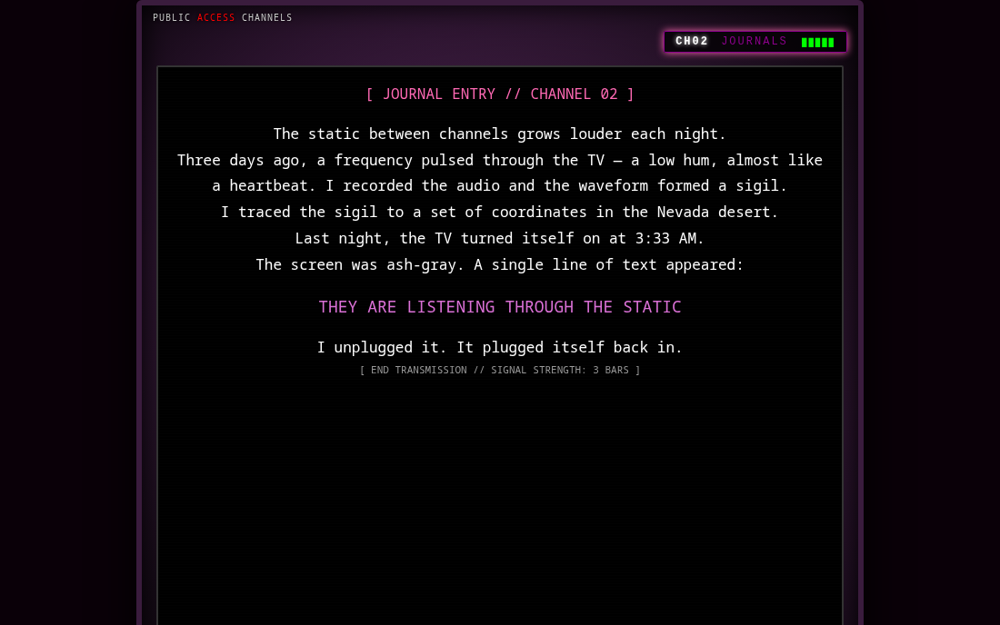

# Public Access Channel

**A tiny website broadcasting network.** People publish short pieces of HTML to numbered channels. The homepage is a CRT television that rotates through them on its own — or you can tune it by hand.

Think public-access TV, except each program is somebody's webpage.

**▶ Watch it live: https://numbpill3d.github.io/public-access-channel/**



---

## Run it locally

Everything is static. There is no build step, no package manager, and no backend.

```bash
git clone https://github.com/numbpill3d/public-access-channel.git
cd public-access-channel
python3 -m http.server 8000
```

Then open <http://localhost:8000>.

You can also just open `index.html` straight from disk (`xdg-open index.html`) — it works, since the only external dependency is Three.js from a CDN.

## Watching

| Action | Control |
|---|---|
| Previous / next channel | `[` / `]`, `←` / `→`, or the **CHANNEL [-]** / **CHANNEL [+]** buttons |
| Jump to a channel | Click a navigation dot below the screen |
| Do nothing | The TV rotates on its own |

**Timing** — the set changes channel every **4 minutes**. Inside a channel with more than one program, it moves to the next program every **40 seconds**. Every switch is covered by **3 seconds of static**, the way a real tuner would.

## The channels

Six channels, currently carrying 11 programs between them.

| Channel | Name | Carries |
|---|---|---|
| **CH02** | JOURNALS | Personal logs, diary entries, thoughts in the dark |
| **CH03** | ART | Visual works, pixel art, glitch compositions |
| **CH04** | COMPUTERS | Code snippets, terminal output, ASCII and text-mode art |
| **CH07** | PERSONAL | Link pages, bios, personal spaces |
| **CH11** | UNKNOWN | Experimental, uncategorized, anomalous broadcasts |
| **CH404** | TEST | Test pattern and debugging |

CH03 and CH11 carry the **NHI pet** — a low-poly Three.js entity that floats, tracks your cursor with three eye-sensors, cycles moods when clicked, and gets hungry if you leave it alone.

## Broadcasting something

**The easy way.** Open [`public_access_submit.html`](public_access_submit.html) in a browser. Fill in a title, your handle, a channel, and your HTML — it previews live and copies the finished JSON to your clipboard. Paste that into the right channel's `programs` array in `public_access_channels.js`.

**By hand.** Add an object to the `programs` array of any channel in `public_access_channels.js`:

```javascript
{
    title: "YOUR PROGRAM TITLE",
    author: "your-handle",
    duration: 15,  // seconds on screen, roughly
    html: '<div style="color:#fff">Your HTML goes here</div>'
}
```

A few things worth knowing:

- Your HTML is injected into the screen area, so it inherits the CRT styling. Inline styles override it.
- Keep it short. This is a TV spot, not a homepage.
- `duration` is a hint — the rotation is what actually drives the pacing.

Then open `index.html` to check it, and send a pull request. If PRs aren't your thing, open an issue with your program pasted in and it'll get added.

## Deploying your own

**GitHub Pages** — fork, then **Settings → Pages → Deploy from a branch → `main` / `/ (root)`**. Because the entry point is `index.html`, it serves at the bare URL with no further configuration. Three.js comes from a CDN, so nothing needs bundling.

**Neocities** — upload the files to your site root. `index.html` becomes your homepage automatically:

```bash
npm install -g neocities
neocities login
neocities upload index.html public_access_channels.js public_access_submit.html \
                nhi_pet.js nhi_pet_widget.html nhi_pet_demo.html
```

**Anything else** — it's a folder of static files. Netlify, Cloudflare Pages, an nginx container, a USB stick. All the same.

## Files

| File | What it is |
|---|---|
| `index.html` | The TV — rotation, CRT frame, static effect, navigation |
| `public_access_channels.js` | **All channel and program content.** This is the file you edit |
| `public_access_submit.html` | Submission form with live preview and JSON export |
| `nhi_pet.js` | The NHI pet, as a reusable module |
| `nhi_pet_widget.html` | Standalone self-contained pet widget |
| `nhi_pet_demo.html` | Minimal demo page for the pet |

The look: vintage wood-and-purple TV frame, scanlines, a signal-strength meter, MS Gothic monospace, and a palette of purple `#8b008b`, magenta `#ff69b4`, green `#0f0`, and red `#ff0000`.

---

*This repository also contains `neocities_sort.py`, an unrelated tool for bulk-organizing files on a Neocities site — see [`README-neocities-sorter.md`](README-neocities-sorter.md).*
